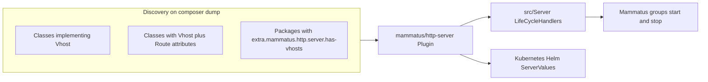

# Multi-vhost HTTP server


[](https://packagist.org/packages/mammatus/http-server)
[](https://packagist.org/packages/mammatus/http-server/stats)
[](https://shepherd.dev/github/MammatusPHP/http-server)
[](https://packagist.org/packages/mammatus/http-server)

Async **multi-vhost** HTTP on [ReactPHP](https://reactphp.org/) and [react/http](https://github.com/reactphp/http) for [MammatusPHP](https://github.com/MammatusPHP/app) applications. [mammatus/http-server](https://github.com/MammatusPHP/http-server) is a Composer plugin that discovers virtual hosts and route handlers across your project and installed packages, then generates ReactPHP server classes and Kubernetes-oriented Helm values. Generated servers implement [`LifeCycleHandler`](https://github.com/MammatusPHP/groups/blob/main/src/Contracts/LifeCycleHandler.php) and start or stop with Mammatus [groups](https://github.com/MammatusPHP/groups).

# Install

To install via [Composer](https://getcomposer.org/), use the command below. Composer picks the latest compatible version and applies a `^` constraint.

```
composer require mammatus/http-server
```

The plugin runs on every `composer dump-autoload` (`pre-autoload-dump`) and via the [`composer generate-config`](https://github.com/MammatusPHP/http-server/blob/master/composer.json) script. Both call [`Mammatus\Http\Server\Composer\Installer::findServers`](https://github.com/MammatusPHP/http-server/blob/master/src/Composer/Installer.php).

# How it works

On autoload dump the plugin scans the codebase and installed packages, collects vhosts, HTTP handlers, and optional Kubernetes metadata, then writes generated PHP under the plugin install path (for example `vendor/mammatus/http-server/` in an application).



- **Discovery filters**: [`Plugin::filters()`](https://github.com/MammatusPHP/http-server/blob/master/src/Composer/Plugin.php) matches packages with `extra.mammatus.http.server.has-vhosts`, classes implementing [`Vhost`](https://github.com/MammatusPHP/http-server-contracts/blob/master/src/Configuration/Vhost.php), and handler classes that carry both [`#[Vhost]`](https://github.com/MammatusPHP/http-server-attributes/blob/main/src/Vhost.php) and [`#[Route]`](https://github.com/MammatusPHP/http-server-attributes/blob/main/src/Route.php).
- **Collection**: [`Collector`](https://github.com/MammatusPHP/http-server/blob/master/src/Composer/Collector.php) yields servers, HTTP handlers, WebSocket [`#[Rpc]`](https://github.com/MammatusPHP/http-server-attributes/blob/main/src/WebSocket/Rpc.php) methods and [`#[Channel]`](https://github.com/MammatusPHP/http-server-attributes/blob/main/src/WebSocket/Channel.php) registrations, and optional [`Service`](https://github.com/MammatusPHP/kubernetes-attributes) / [`Ingress`](https://github.com/MammatusPHP/kubernetes-attributes) items from vhost classes.
- **Generated output**:
  - [`Server.php.twig`](https://github.com/MammatusPHP/http-server/blob/master/etc/generated_templates/Server.php.twig) to `src/Server/{PascalVhostName}.php` (one [`LifeCycleHandler`](https://github.com/MammatusPHP/groups/blob/main/src/Contracts/LifeCycleHandler.php) per vhost)
  - [`ServerValues.php.twig`](https://github.com/MammatusPHP/http-server/blob/master/etc/generated_templates/ServerValues.php.twig) to [`ServerValues`](https://github.com/MammatusPHP/http-server/blob/master/src/Kubernetes/Helm/ServerValues.php) for Helm integration
- **Do not edit generated files manually**. They are overwritten on the next install or update (see the banner on [`Frontend`](https://github.com/MammatusPHP/http-server/blob/master/src/Server/Frontend.php)).
- **Routing**: [FastRoute](https://github.com/nikic/FastRoute) with a on-disk route cache under `var/fast-route/{vhostName}` inside generated code.
- **Per-vhost HTTP stack**: request logging, body buffer and parser, optional PSR-15 middleware from the vhost, optional [webroot preload middleware](https://github.com/WyriHaximus/reactphp-http-middleware-webroot-preload), then FastRoute dispatch.
- **WebSockets**: when a vhost has RPC or channel handlers (or vhost WebSocket attributes), generated servers add [`Rfc6455UpgradeMiddleware`](src/WebSocket/Rfc6455UpgradeMiddleware.php), a [`WebSocketHub`](src/WebSocket/WebSocketHub.php) (via `webSocketHub()` with `publish()` and [`onChannelSubscribe()`](src/WebSocket/WebSocketHub.php)), an object hydrator under `src/Server/WebSocket/Hydrators/`, and optionally [`WebSocketClientAssetMiddleware`](src/WebSocket/Middleware/WebSocketClientAssetMiddleware.php) when [`#[ServeClientAsset]`](https://github.com/MammatusPHP/http-server-attributes/blob/main/src/WebSocket/ServeClientAsset.php) is present on the vhost class.

# Define a virtual host

Implement [`Mammatus\Http\Server\Configuration\Vhost`](https://github.com/MammatusPHP/http-server-contracts/blob/master/src/Configuration/Vhost.php): static `name()`, `port()`, and `webroot()` ([`NoWebroot`](https://github.com/MammatusPHP/http-server-webroot) or a path-backed webroot), plus instance `middleware()`. Optional [`#[Group]`](https://github.com/MammatusPHP/groups), [`#[Service]`](https://github.com/MammatusPHP/kubernetes-attributes), and [`#[Ingress]`](https://github.com/MammatusPHP/kubernetes-attributes) on the class feed Helm values generation.

Example from this repository's dev app ([`FrontendVhost.php`](https://github.com/MammatusPHP/http-server/blob/master/etc/dev-app/FrontendVhost.php)):

```php
<?php declare(strict_types=1);

namespace Mammatus\DevApp\Http\Server;

use Mammatus\Groups\Attributes\Group;
use Mammatus\Groups\Type;
use Mammatus\Http\Server\Configuration\Vhost;
use Mammatus\Http\Server\Configuration\Webroot;
use Mammatus\Http\Server\Webroot\NoWebroot;
use Mammatus\Kubernetes\Attributes\Ingress;
use Mammatus\Kubernetes\Attributes\Service;
use Psr\Http\Server\MiddlewareInterface;

#[Group(Type::Daemon, 'frontend')]
#[Service]
#[Ingress('www.example.com')]
final class FrontendVhost implements Vhost
{
    private const string SERVER_NAME = 'frontend';
    private const int LISTEN_PORT    = 1337;

    public static function port(): int
    {
        return self::LISTEN_PORT;
    }

    public static function name(): string
    {
        return self::SERVER_NAME;
    }

    public static function webroot(): Webroot
    {
        return new NoWebroot();
    }

    public static function maxConcurrentRequests(): null
    {
        return null;
    }

    /** @return iterable<MiddlewareInterface> */
    public function middleware(): iterable
    {
        yield from [];
    }
}
```

For a ready-made health and probe vhost, see [mammatus/healthz-vhost](https://github.com/MammatusPHP/healthz-vhost) (port **9666**, Kubernetes probes, static files under [`public/`](https://github.com/MammatusPHP/healthz-vhost/tree/master/public)).

# HTTP route handlers

Handlers are plain PHP classes annotated with [`#[Vhost]`](https://github.com/MammatusPHP/http-server-attributes/blob/main/src/Vhost.php) and [`#[Route]`](https://github.com/MammatusPHP/http-server-attributes/blob/main/src/Route.php). The collector ([`Collector::handler()`](https://github.com/MammatusPHP/http-server/blob/master/src/Composer/Collector.php)) registers each matching **public** method that is not a constructor or destructor and has **zero or one** parameter. With one parameter, the type is a route payload DTO (FastRoute path segments map into it). Static and instance methods are both supported ([`Handler`](https://github.com/MammatusPHP/http-server/blob/master/src/Composer/Handler.php)).

Home page handler ([`HomePageHandler.php`](https://github.com/MammatusPHP/http-server/blob/master/etc/dev-app/HomePageHandler.php)):

```php
#[Vhost('frontend')]
#[Route(HttpMethod::GET, '/')]
final readonly class HomePageHandler
{
    public function handle(): ResponseInterface
    {
        return new Response(OK, ['Content-Type' => 'text/plain'], 'Hello World!');
    }
}
```

Route parameter payload ([`PingHandler.php`](https://github.com/MammatusPHP/http-server/blob/master/etc/dev-app/PingHandler.php) and [`Ping.php`](https://github.com/MammatusPHP/http-server/blob/master/etc/dev-app/Ping.php)):

```php
#[Vhost('frontend')]
#[Route(HttpMethod::GET, '/ping/{name}')]
final readonly class PingHandler
{
    public function handle(Ping $ping): ResponseInterface
    {
        return new Response(OK, ['Content-Type' => 'application/json'], '{}');
    }
}
```

Probe routes and other attributes are documented in [mammatus/http-server-attributes](https://github.com/MammatusPHP/http-server-attributes/blob/main/README.md).

# WebSockets

WebSockets share the vhost listen port. After an HTTP upgrade, clients send JSON frames with an `op` field ([`WireMessage`](src/WebSocket/Protocol/WireMessage.php)). Attributes live in [mammatus/http-server-attributes](https://github.com/MammatusPHP/http-server-attributes/tree/main/src/WebSocket).

**Vhost class attributes** (read by [`WebSocketVhostConfiguration`](src/WebSocket/WebSocketVhostConfiguration.php)):

| Attribute | Purpose |
|-----------|---------|
| [`#[HeartbeatInterval(seconds: float)]`](https://github.com/MammatusPHP/http-server-attributes/blob/main/src/WebSocket/HeartbeatInterval.php) | Periodic RFC6455 PING and optional `evt` on the heartbeat channel. Omit for default **13** seconds; **`seconds <= 0`** disables heartbeat. |
| [`#[HeartbeatChannel('name')]`](https://github.com/MammatusPHP/http-server-attributes/blob/main/src/WebSocket/HeartbeatChannel.php) | Channel name for heartbeat events (default [`heartbeat`](src/WebSocket/WebSocketDefaults.php)). |
| [`#[ServeClientAsset]`](https://github.com/MammatusPHP/http-server-attributes/blob/main/src/WebSocket/ServeClientAsset.php) | Serves the bundled ES module at [`/.well-known/mammatus/websocket-client.mjs`](src/WebSocket/ClientAsset.php). |

The dev-app vhost uses `#[ServeClientAsset]` ([`FrontendVhost.php`](https://github.com/MammatusPHP/http-server/blob/master/etc/dev-app/FrontendVhost.php)).

**RPC handlers:** `#[Vhost('…')]` on the class and `#[Rpc('methodName')]` on a public method. Supported signatures ([`Collector`](https://github.com/MammatusPHP/http-server/blob/master/src/Composer/Collector.php)):

- `(ServerRequestInterface $upgradeRequest)` only
- `(ParamsDto $params, ServerRequestInterface $upgradeRequest)` with a DTO first argument

Return a DTO, scalar, or `React\Promise\PromiseInterface` for async work. Example [`WebSocketPingHandler.php`](etc/dev-app/WebSocketPingHandler.php):

```php
#[Vhost('frontend')]
final readonly class WebSocketPingHandler
{
    #[Rpc('ping')]
    public function ping(WebSocketPingParams $params, ServerRequestInterface $upgradeRequest): WebSocketPingResult
    {
        return new WebSocketPingResult(pong: true, echo: $params->message);
    }
}
```

**Pub/sub channels:** `#[Channel('channel-name', PayloadClass::class)]` on a class with the same `#[Vhost]`. Payload objects serialize through the generated hydrator. Example [`WebSocketDemoEvent.php`](etc/dev-app/WebSocketDemoEvent.php).

- **Publish:** from application code that can reach the vhost generated [`LifeCycleHandler`](https://github.com/MammatusPHP/groups/blob/main/src/Contracts/LifeCycleHandler.php), call `webSocketHub()->publish('channel-name', $payload)`.
- **Subscribe hook:** [`WebSocketHub::onChannelSubscribe()`](src/WebSocket/WebSocketHub.php) registers a `callable` invoked with a [`Connection`](src/WebSocket/Connection.php) and the channel name when a client successfully subscribes. Clients send `{"op":"sub","c":"channel-name"}` (see [`subscribe()`](etc/js/mammatus-websocket-client.mjs) in the browser client). Register during startup from the same kind of code that calls `publish()`; do not edit generated `src/Server/*.php`. Each call replaces the previous callback. Duplicate `sub` for the same connection and channel does not invoke the callback again.

```php
use Mammatus\Http\Server\WebSocket\Connection;

// $vhostServer: generated LifeCycleHandler for the vhost (inject via your DI container).
$vhostServer->webSocketHub()->onChannelSubscribe(
    static function (Connection $connection, string $channel): void {
        // Metrics, logging, or push an initial evt to $connection, etc.
    },
);
```

**Browser client:** import [`MammatusWebSocket`](etc/js/mammatus-websocket-client.mjs) from the well-known URL when `#[ServeClientAsset]` is enabled. Interactive demo: HTTP route [`/demo/websocket`](etc/dev-app/DemoWebSocketPageHandler.php).

# Publishing vhosts from a Composer package

Set `extra.mammatus.http.server.has-vhosts` to `true` in `composer.json` so the plugin scans that package for `Vhost` implementations and attributed handlers (this package and [healthz-vhost](https://github.com/MammatusPHP/healthz-vhost) use the same flag):

```json
"extra": {
  "mammatus": {
    "http": {
      "server": {
        "has-vhosts": true
      }
    }
  }
}
```

Application code and every scanned package contribute handlers to the same generated servers keyed by vhost name.

# Hacking this repository

See [`CONTRIBUTING.md`](CONTRIBUTING.md). Run `make install`, then `make contrib` while iterating and `make` before opening a pull request. Example vhost and handlers live under [`etc/dev-app/`](https://github.com/MammatusPHP/http-server/tree/master/etc/dev-app).

# License

The MIT License (MIT)

Copyright (c) 2026 Cees-Jan Kiewiet

Permission is hereby granted, free of charge, to any person obtaining a copy
of this software and associated documentation files (the "Software"), to deal
in the Software without restriction, including without limitation the rights
to use, copy, modify, merge, publish, distribute, sublicense, and/or sell
copies of the Software, and to permit persons to whom the Software is
furnished to do so, subject to the following conditions:

The above copyright notice and this permission notice shall be included in all
copies or substantial portions of the Software.

THE SOFTWARE IS PROVIDED "AS IS", WITHOUT WARRANTY OF ANY KIND, EXPRESS OR
IMPLIED, INCLUDING BUT NOT LIMITED TO THE WARRANTIES OF MERCHANTABILITY,
FITNESS FOR A PARTICULAR PURPOSE AND NONINFRINGEMENT. IN NO EVENT SHALL THE
AUTHORS OR COPYRIGHT HOLDERS BE LIABLE FOR ANY CLAIM, DAMAGES OR OTHER
LIABILITY, WHETHER IN AN ACTION OF CONTRACT, TORT OR OTHERWISE, ARISING FROM,
OUT OF OR IN CONNECTION WITH THE SOFTWARE OR THE USE OR OTHER DEALINGS IN THE
SOFTWARE.
